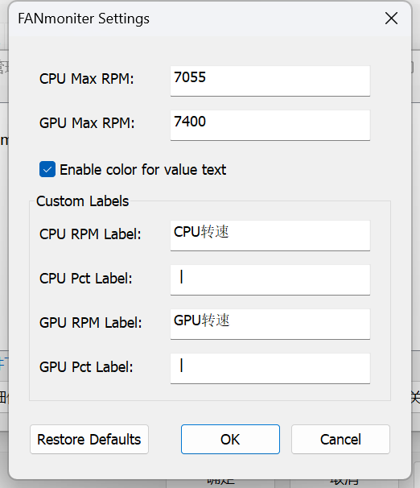

# FANmoniter - TrafficMonitor Fan监控插件

这是一个为 [TrafficMonitor](https://github.com/zhongyang219/TrafficMonitor) 开发的插件，用于通过 EC (Embedded Controller) 直接读取并显示 CPU 和 GPU 的风扇转速。

## 功能特点

- **实时监控**: 直接从硬件 EC 寄存器读取 CPU 和 GPU 风扇的 RPM (转速)。
- **百分比显示**: 根据设定的最大转速自动计算风扇运行百分比。
- **平滑颜色渐变**: 数值颜色随转速动态变化（蓝 -> 绿 -> 黄 -> 红 -> 紫），直观反映散热负载。
- **高度可定制**:
  - 自定义显示标签（如 "CPU风扇", "GPU Fan" 等）。
  - 自定义显示格式（如 "X RPM", "Y%"）。
  - 可手动设置 CPU/GPU 的最大转速以校准百分比。
  - 支持开启或关闭数值颜色显示。
- **自适应暗黑模式**: 完美适配 TrafficMonitor 的皮肤 and 暗黑/亮色模式。

## 截图展示

### 任务栏显示效果（随转速颜色渐变）
| 低负载 | 中低负载 | 中高负载 | 高负载 |
| :---: | :---: | :---: | :---: |
|  |  |  |  |

### 选项设置界面

## 安装说明

1. 确保你已安装了 [TrafficMonitor](https://github.com/zhongyang219/TrafficMonitor)。
2. 将编译生成的 `FANmoniter.dll` 放入 TrafficMonitor 的 `plugins` 文件夹下。
3. **重要依赖**: 确保 `InpOutx64.dll` 位于 TrafficMonitor 的主程序目录下，因为插件需要它来访问底层硬件端口。
4. 重启 TrafficMonitor，在“插件管理”中启用 **FANmoniter**。

## 编译说明

### 环境要求
- Visual Studio 2022 (或支持 C++17 的版本)
- Windows SDK 10.0+

### 编译步骤
1. 使用 Visual Studio 打开 [FANmoniter.vcxproj](FANmoniter.vcxproj)。
2. 选择 `Release` 配置和 `x64` 平台。
3. 点击“生成解决方案”。
4. 编译产物位于 `x64/Release/FANmoniter.dll`。

或者你可以直接运行目录下的 `build.bat` 进行快速编译（需要配置好 MSBuild 路径）。

## 配置建议

在插件的选项对话框中，你可以设置：
- **最大转速**: 不同机型的风扇最大转速不同，请根据官方规格书进行设置（默认为 CPU: 7055, GPU: 7400）。
- **自定义标签**: 如果你想在任务栏显示更简洁的名称，可以在此修改。

## 核心依赖
- [InpOut32/64](http://www.highrez.co.uk/scripts/download.asp?package=InpOutBinaries): 用于 64 位 Windows 系统下的底层 I/O 访问。

## 开源协议
本项目采用 [MIT License](LICENSE) 开源协议。

## 免责声明
本插件通过直接访问硬件 EC 寄存器获取数据。虽然程序仅执行读取操作，但由于涉及底层硬件 I/O 访问，**请在已知兼容的硬件上使用**。作者不对因使用本插件导致的任何硬件损坏、系统不稳定或数据丢失承担责任。使用本插件即表示您同意自行承担风险。

---------------------------English/英文---------------------------

# FANmoniter - TrafficMonitor Fan Monitoring Plugin

This is a plugin for [TrafficMonitor](https://github.com/zhongyang219/TrafficMonitor) developed to read and display CPU and GPU fan speeds directly via EC (Embedded Controller).

## Features

- **Real-time Monitoring**: Reads CPU and GPU fan RPM directly from hardware EC registers.
- **Percentage Display**: Automatically calculates fan operating percentage based on set maximum RPM.
- **Smooth Color Gradient**: Value colors change dynamically with speed (Blue -> Green -> Yellow -> Red -> Purple), intuitively reflecting thermal load.
- **Highly Customizable**:
  - Custom display labels (e.g., "CPU Fan", "GPU Fan").
  - Custom display formats (e.g., "X RPM", "Y%").
  - Manually set CPU/GPU max RPM for percentage calibration.
  - Option to enable/disable value coloring.
- **Adaptive Dark Mode**: Perfectly fits TrafficMonitor skins and dark/light modes.

## Screenshots

### Taskbar Effects (Color gradient with speed)
| Low Load | Low-Mid Load | Mid-High Load | High Load |
| :---: | :---: | :---: | :---: |
|  |  |  |  |

### Options Dialog

## Installation

1. Ensure [TrafficMonitor](https://github.com/zhongyang219/TrafficMonitor) is installed.
2. Place the compiled `FANmoniter.dll` into the TrafficMonitor `plugins` folder.
3. **Important Dependency**: Ensure `InpOutx64.dll` is in the TrafficMonitor main directory, as the plugin requires it for low-level hardware port access.
4. Restart TrafficMonitor and enable **FANmoniter** in "Plugin Management".

## Build Instructions

### Requirements
- Visual Studio 2022 (or versions supporting C++17)
- Windows SDK 10.0+

### Steps
1. Open [FANmoniter.vcxproj](FANmoniter.vcxproj) with Visual Studio.
2. Select `Release` configuration and `x64` platform.
3. Click "Build Solution".
4. The output is located at `x64/Release/FANmoniter.dll`.

Alternatively, run `build.bat` for a quick build (requires MSBuild path configuration).

## Configuration

In the plugin options dialog, you can set:
- **Max RPM**: Max speeds vary by model; set according to official specs (Default: CPU: 7055, GPU: 7400).
- **Custom Labels**: Modify for a cleaner taskbar appearance.

## Dependencies
- [InpOut32/64](http://www.highrez.co.uk/scripts/download.asp?package=InpOutBinaries): For low-level I/O access on 64-bit Windows.

## License
This project is licensed under the [MIT License](LICENSE).

## Disclaimer
This plugin accesses hardware EC registers directly. While it only performs read operations, **please use it on known compatible hardware**. The author is not responsible for any hardware damage, system instability, or data loss caused by using this plugin. Use at your own risk.
